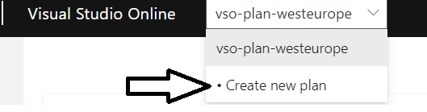
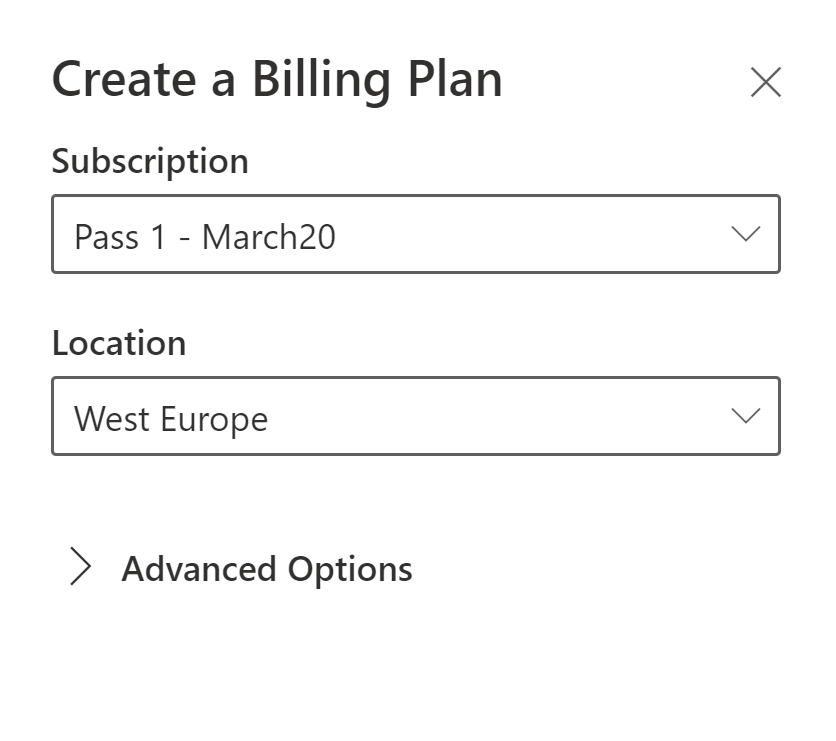
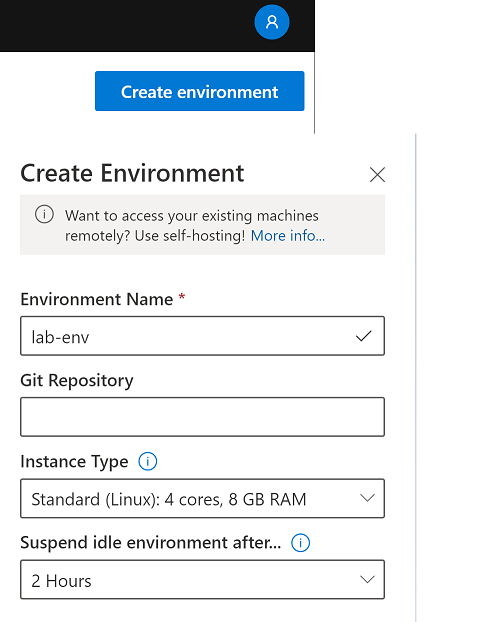
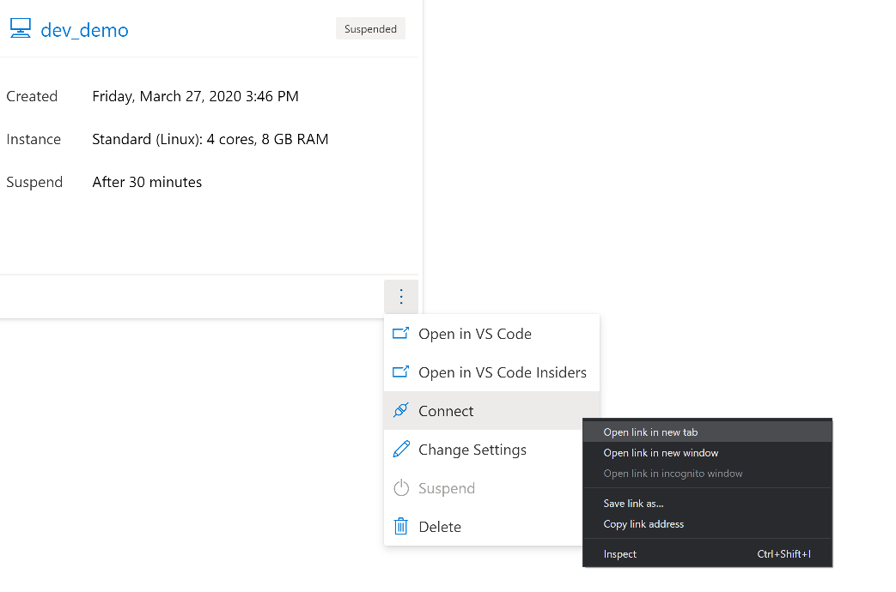

### 00 Azure and VS online setup

Claim your azure subscription and create your azure account using the temporary hotmail / outlook account

> Note: Open below link in incognito/private mode if you are laptop is configured to automatically login to azure portal via AD integration

Goto https://www.microsoftazurepass.com/ and click `start`

Once your Azure Account is ready, go to https://online.visualstudio.com/login and click `sign in`

Enter your temporary outlook / hotmail account credentials. (same one used for azure portal)

### Create a new plan

Select your subscription, Set location to `west europe` and hit `create`

### Create environment

Give your environment a name and set it to auto suspend after `2 hours` of inactivity

### Connect to environment

### You should be able to see VS code online on your browser tab. If this doesn't work as expected, reach out to your instructor