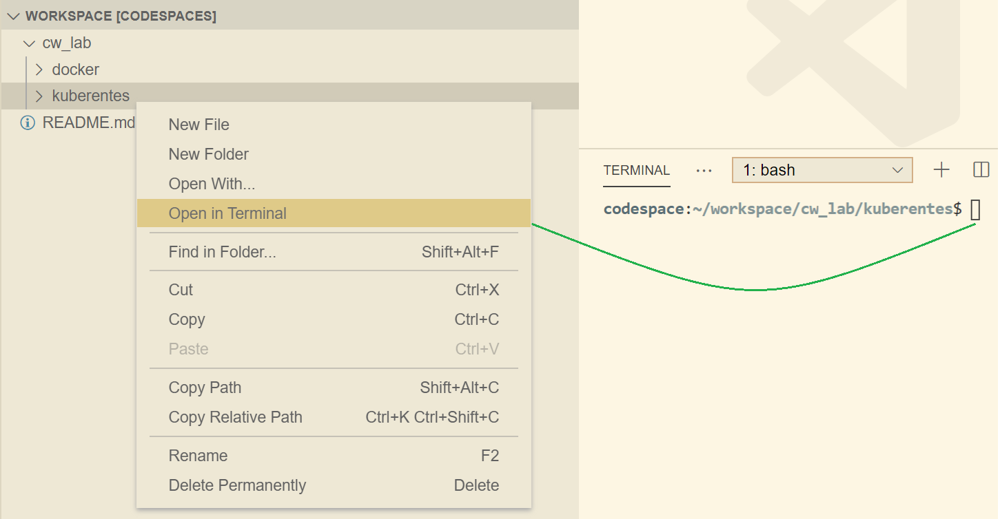

# Setup for Kubernetes Labs

1. Similar to Docker, make sure you are well aware of the directory you will be using for your kubernetes labs.

2. If you're on codespaces, note that `~/workspace` is the default directory that will open everytime you launch your codespace environment (vs code online).

3. Set your current working directory on terminal to `cw_labs\kubernetes`. We will store the files and folders for our `k8s`(kubernetes) related labs inside this directory. (and will also start with executing `kubectl` commands from here for extra convenience)

4. You can set the current working directory on terminal by either `command line` or `vs code`. Below are examples of both.

    * VS code / Codespaces (you can use the same approach for creating new files and directories as well) 
    * **Or** from Terminal, do a `cd` into that directory as below 
      ```bash
      cd ~/workspace/cw_lab/kubernetes
      ```
